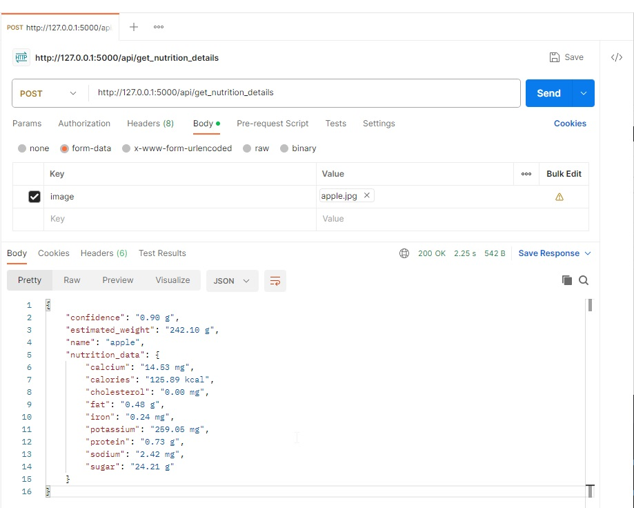

# Botanical Nutrition Estimator

Welcome to the Botanical Nutrition Estimator! This application uses computer vision and machine learning to estimate the volume, weight, and nutritional values of fruits and vegetables from images.

<p align="center">
    <a href="https://www.python.org/">
        
    </a>
    <a href="https://opencv.org/">
        
    </a>
    <a href="https://flask.palletsprojects.com/">
        
    </a>
    <a href="https://numpy.org/">
        
    </a>
    <a href="https://pandas.pydata.org/">
        
    </a>
    <a href="https://opensource.org/licenses/MIT">
        
    </a>
</p>

## 🌟 **Introduction**
This project provides an API that estimates nutritional information for fruits and vegetables using image recognition. By uploading an image of a fruit or vegetable, the system calculates its volume, weight, and nutritional content based on predefined models and datasets.

## 🚀 **Getting Started**

### **1. Setup Your Environment**

#### Install Dependencies

Ensure you have Python installed. Then, install the necessary packages:

```
pip install -r requirements.txt
```

#### Create a Virtual Environment

To isolate your project dependencies, create and activate a virtual environment:

```
python -m venv env
source env/bin/activate  # On Windows use `env\Scripts\activate`
```

### **2. Project Structure**
Here's how the project is organized:

```
netclues-botanical-nutrition-estimator/
├── app.py                # Flask application
├── nutrition_details.py  # Core functionality for image processing and nutrition estimation
├── requirements.txt      # Dependencies list
└── README.md             # This guide
```

### **3. Understanding the Files**
- `app.py`: Sets up the Flask application and routes for handling image uploads.
- `nutrition_details.py`: Contains functions for image processing, volume, weight estimation, and nutrition data extraction.
- `requirements.txt`: Lists all dependencies required for the project.

## 🛠️ **Usage**

### **Run the Project**

Start the Flask server:

```
python app.py
```
The server will be available at http://127.0.0.1:5000.

### **API Endpoint**
**POST `/api/get_nutrition_details`**

Upload an image to get fruit details:

- `URL`: http://127.0.0.1:5000/api/get_nutrition_details
- `Method`: POST
- `Form Data`: image (File)

#### **Example using curl:**

```
curl -X POST -F 'image=@path/to/fruit.jpg' http://127.0.0.1:5000/api/fruit_details
```

### **Sample Response**

```
{
    "confidence": "0.90 g",
    "estimated_weight": "242.10 g",
    "name": "apple",
    "nutrition_data": {
        "calcium": "14.53 mg",
        "calories": "125.89 kcal",
        "cholesterol": "0.00 mg",
        "fat": "0.48 g",
        "iron": "0.24 mg",
        "potassium": "259.05 mg",
        "protein": "0.73 g",
        "sodium": "2.42 mg",
        "sugar": "24.21 g"
    }
}
```

#### **Example using Postman:**

<p align="center"> 
    
</p>

## 👩‍💻 **Contributing**

Feel free to fork this repository and make improvements. Contributions are welcome!

## 📄 **License**
This project is licensed under the MIT License. See the LICENSE file for more details.
